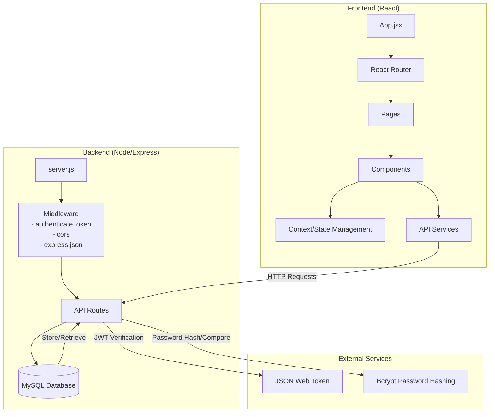
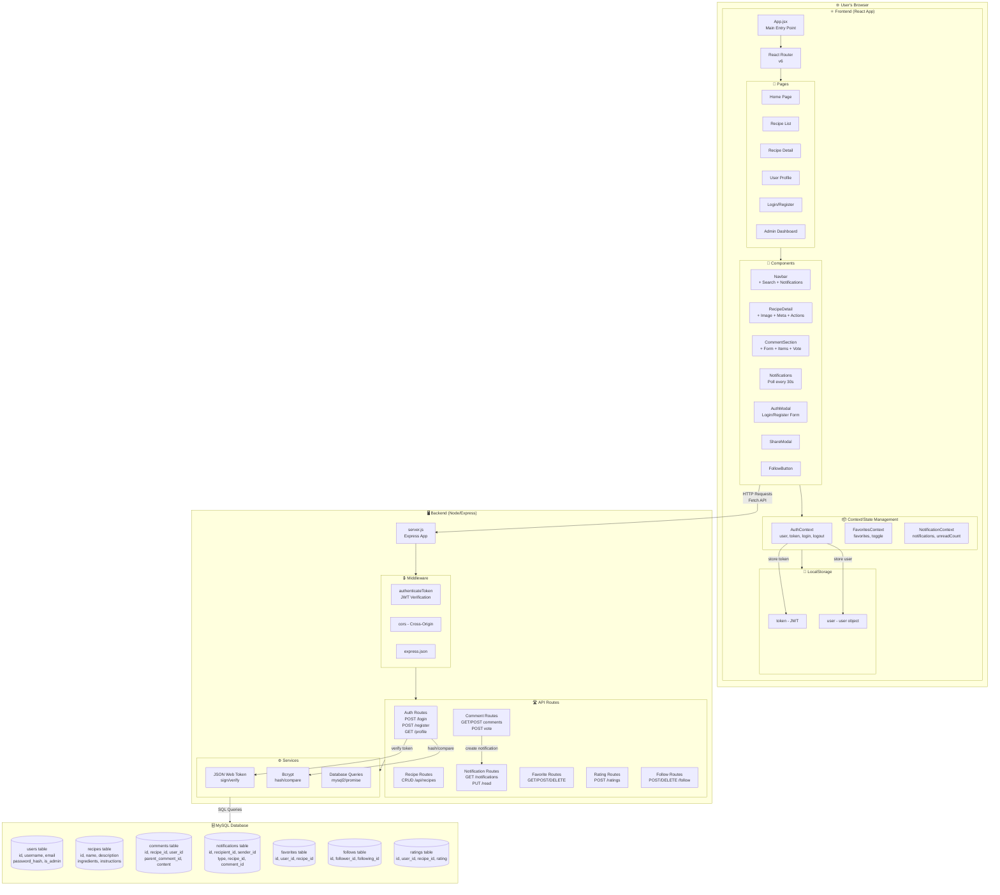
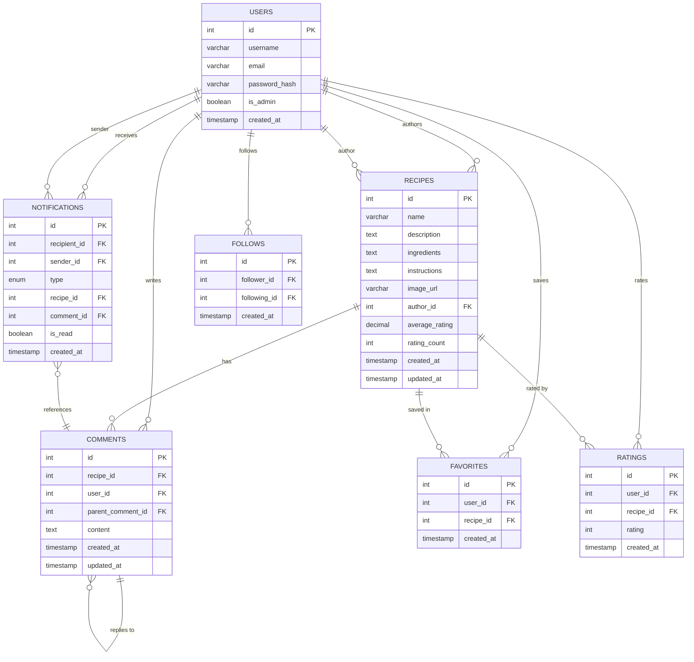
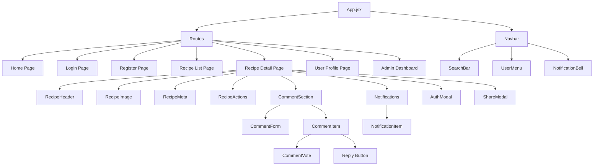
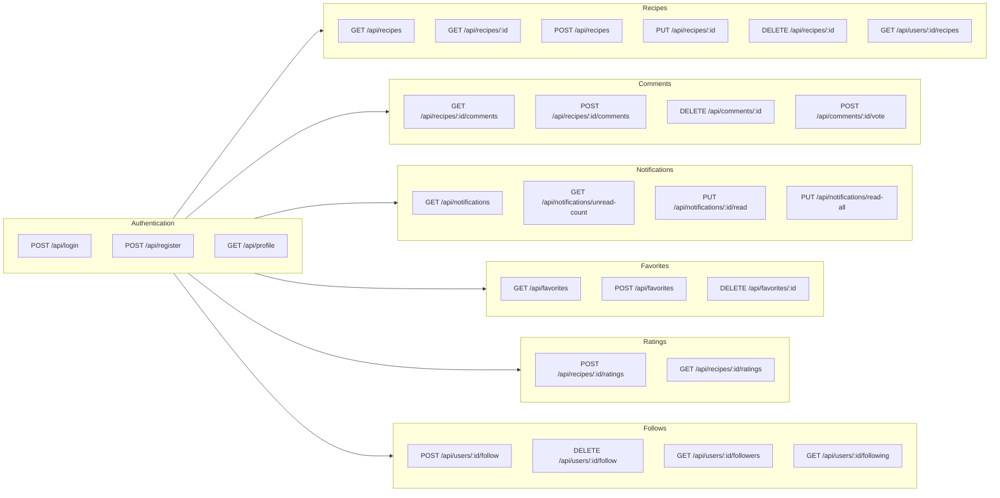
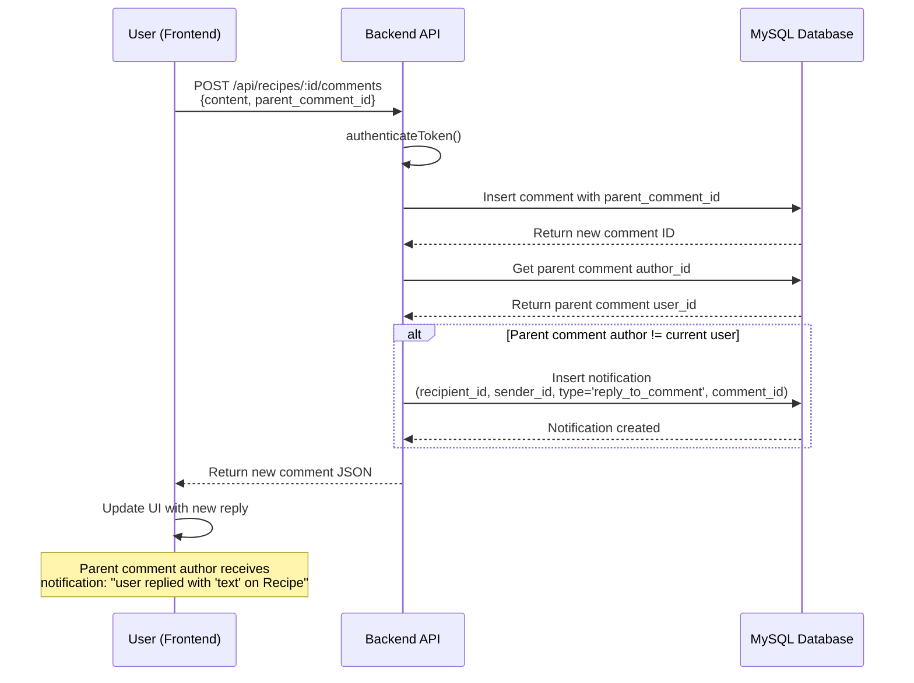
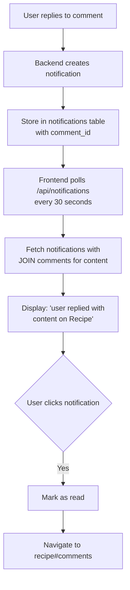

# Recipe App - System Architecture

## Overview
Mermaid UML diagrams for the complete Recipe App architecture including frontend, backend, and database.

---

## 1. System Architecture Overview



---

## 2. Complete System Component Diagram



---

## 3. Database Schema (ER Diagram)



---

## 4. Frontend Component Hierarchy



---

## 5. Backend API Endpoints



---

## 6. Data Flow - Comment Reply with Notification



---

## 7. Notification System Flow



---

## 8. Key Technologies

| Layer | Technology |
|-------|-------------|
| Frontend | React 18, React Router v6, Context API |
| Backend | Node.js, Express.js |
| Database | MySQL |
| Auth | JWT (JSON Web Token), bcrypt |
| Styling | CSS Variables, Flexbox, Grid |
| State | React Context (Auth, Favorites, Notifications) |

---

## 9. File Structure

```
recipe-app/
├── backend/
│   └── server.js          # Express server, all API routes, DB init
├── frontend/
│   └── src/
│       ├── components/
│       │   ├── AuthModal.jsx
│       │   ├── CommentSection.jsx
│       │   ├── CommentItem.jsx
│       │   ├── CommentForm.jsx
│       │   ├── CommentVote.jsx
│       │   ├── Notifications.jsx
│       │   ├── RecipeDetail.jsx
│       │   └── ...
│       ├── context/
│       │   ├── AuthContext.jsx
│       │   ├── FavoritesContext.jsx
│       │   └── NotificationContext.jsx
│       ├── pages/
│       └── App.jsx
└── ARCHITECTURE.md       # This file
```
